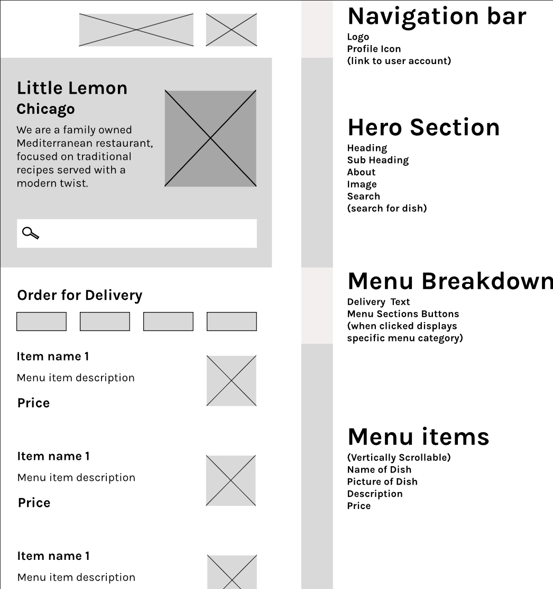

# **Little Lemon Restaurant App** 

The **Little Lemon Restaurant App** represents the final achievement of the iOS App Capstone, a crucial part of the Meta iOS Developer Professional Certificate program. This application streamlines the process of ordering food, making it effortless for users to browse the menu of the Little Lemon restaurant and easily place their orders.

## **Getting Started**
To run the app, make sure Xcode is installed. Clone the repository, open the project in Xcode, and build and run the app on your preferred simulator or device. Enjoy the Little Lemon experience!

## **Wireframe**
The Home screen design is based on the following wireframe:

## **Notable Features**
- An engaging onboarding experience prompts users to input their personal details.
- The stack-based navigation system offers easy screen traversal with a Back button.
- The home screen comprises a header, an attention-grabbing hero section, an informative menu breakdown, and a user-friendly food menu list.
- The profile screen showcases users' personal details.
- Enhanced profile editing ensures changes persist even after app restarts.

## **Sneak Peek**

